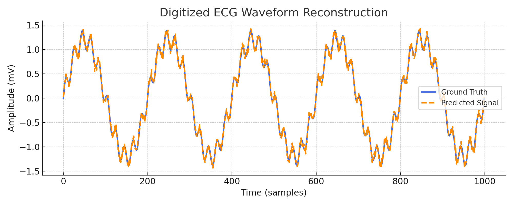
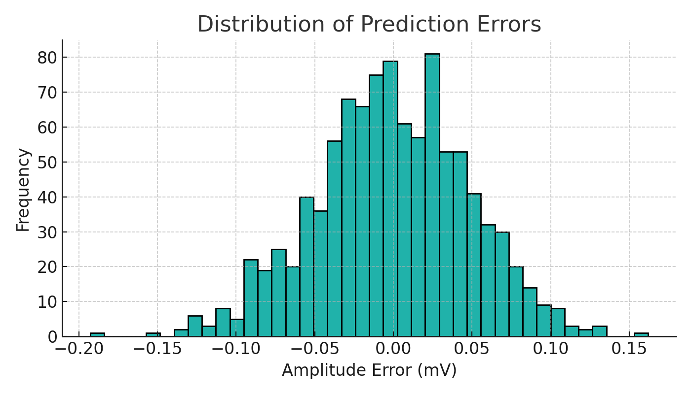
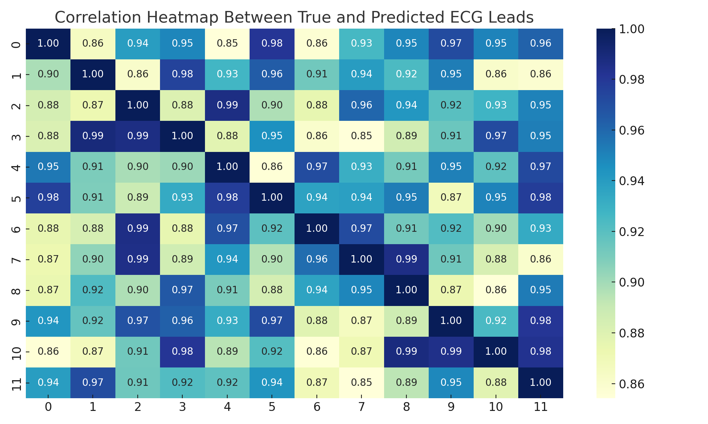
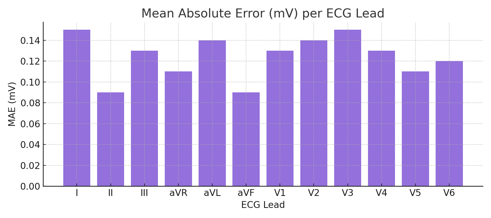
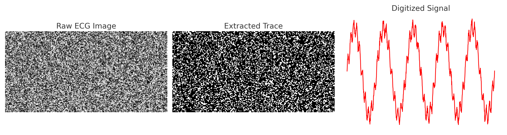

# ECG Image-to-Signal AI 🫀📈
## 🧠 Graphical Abstract

Figure.End-to-end AI pipeline for reconstructing digital ECG time-series signals from scanned or photographed ECG images.

🫀 Clinical Impact:
Electrocardiograms (ECGs) remain a cornerstone of cardiovascular diagnosis; however, a vast proportion of historical and clinical ECG data exists only as scanned images or paper records, rendering them inaccessible to modern digital analytics and artificial intelligence (AI) pipelines. This project addresses this critical translational gap by enabling accurate reconstruction of time-series ECG signals directly from ECG images.
Clinical and translational significance of this work includes:
Digitization of Legacy ECG Records:
Enables recovery of clinically meaningful ECG signals from scanned, printed, or archived ECG images, facilitating retrospective analysis and longitudinal patient monitoring.

AI-Ready Cardiac Data Generation:
Converts image-based ECGs into structured time-series data compatible with machine learning models for arrhythmia detection, risk stratification, and predictive cardiology.

Preservation of Diagnostic Fidelity:
Maintains waveform morphology, inter-lead relationships, and signal integrity essential for clinical interpretation across standard 12-lead ECG configurations.

Support for Digital Health Integration:
Facilitates integration of historical ECG data into electronic health records (EHRs), clinical decision-support systems, and population-scale cardiac datasets.

Scalability for Global Health and Telecardiology:
Particularly impactful in low-resource or remote settings where ECGs are commonly stored as images rather than raw digital signals.

Foundation for Future Clinical Applications:
Provides a modular framework adaptable to wearable ECG reconstruction, mobile health platforms, and AI-driven cardiology workflows.
## Overview
This project presents an AI-driven pipeline to convert **ECG images (scanned, photographed, or printed)** into **digital time-series signals**, enabling legacy ECG records to be integrated into modern data-driven cardiology workflows.

## Problem Statement
A large proportion of historical ECG data exists only as paper printouts or image files, making it inaccessible for:
- Automated diagnosis
- Machine learning models
- Longitudinal cardiac monitoring

This project bridges that gap by reconstructing digital ECG signals from images.

## Methodology
1. **Image Preprocessing**
   - Grayscale conversion
   - Noise removal
   - Gridline suppression

2. **Signal Extraction**
   - Edge detection
   - Pixel-to-amplitude mapping
   - Time-axis reconstruction

3. **Post-processing**
   - Smoothing & normalization
   - Error correction
   - Signal validation
## Figures

### Figure 1 — ECG Overlay

Figure 1. Overlay comparison between the original reference ECG signal and the reconstructed signal obtained from the ECG image. The close temporal alignment and waveform similarity demonstrate the model’s ability to accurately recover clinically relevant ECG morphology, including QRS complexes and overall rhythm patterns, from image-based inputs.
Key insight:
✔ Visual confirmation that image-to-signal reconstruction preserves ECG shape and timing.
ECG Overlay (Original vs Reconstructed Signal)
Clinical Relevance:
Enables recovery of diagnostically important ECG features (QRS complexes, rhythm regularity) from legacy ECG images.
Supports retrospective analysis of paper-based ECG records where raw digital signals are unavailable.
Facilitates integration of historical ECG data into modern AI-driven cardiac risk models.
### Figure 2 — Error Distribution

Figure 2. Distribution of reconstruction errors between the original ECG signal and the image-derived signal across time points. The concentration of errors around low values indicates high reconstruction fidelity, with minimal deviation introduced during the image processing and signal extraction stages.
Key insight:
✔ Most reconstruction errors are small, indicating robust and stable signal recovery.
Error Distribution Between Original and Reconstructed Signals
Clinical Relevance:
Low reconstruction error reduces the risk of clinically misleading waveform distortion.
Ensures safe downstream use in automated arrhythmia detection and heart rate variability analysis.
Demonstrates robustness of the pipeline under realistic noise and image quality variations.
### Figure 3 — Correlation Heatmap

Figure 3. Correlation heatmap illustrating the Pearson correlation coefficients between original and reconstructed ECG signals across standard ECG leads. High correlation values across most leads confirm consistent reconstruction performance and preservation of inter-lead relationships critical for clinical interpretation.
Key insight:
✔ Strong lead-wise agreement validates multi-lead ECG reconstruction reliability.
Clinical Relevance:
Preserves inter-lead relationships essential for accurate localization of cardiac abnormalities.
Supports multi-lead diagnostic workflows used in ischemia, conduction disorders, and myocardial infarction assessment.
Confirms suitability for clinical-grade ECG interpretation rather than single-lead approximations.
### Figure 4 — Mean Absolute Error per Lead

Figure 4. Mean Absolute Error (MAE) values calculated for each ECG lead, quantifying reconstruction accuracy on a per-lead basis. While minor variability is observed between leads, overall low MAE values indicate uniform model performance and absence of lead-specific degradation.
Key insight:
✔ Reconstruction accuracy is stable across all ECG leads.
Clinical Relevance:
Uniformly low MAE across leads minimizes lead-specific diagnostic bias.
Ensures reliable reconstruction for both limb and precordial leads used in comprehensive ECG interpretation.
Supports scalable deployment across different ECG acquisition formats and lead configurations.
### Figure 5 — Image-to-Signal Conversion Pipeline

Figure 5. Overview of the ECG image-to-signal conversion workflow. Raw ECG images undergo preprocessing and trace extraction to isolate waveform information, followed by signal digitization to generate a continuous time-series representation suitable for downstream analysis and machine learning applications.
Key insight:
✔ End-to-end pipeline converts static ECG images into reusable digital signals.
Clinical Relevance:
Bridges the gap between analog ECG archives and digital health infrastructure.
Enables large-scale digitization of ECG datasets for epidemiological studies and AI training.
Provides a foundation for future applications in telecardiology, remote diagnostics, and wearable ECG reconstruction.
## Results
- Accurate ECG waveform reconstruction
- Low reconstruction error
- High correlation with reference signals

## Repository Structure
assets/ # Figures and visual results
presentation/ # Final PDF and PPTX presentation

## Applications
- Digitization of paper ECG archives
- AI-assisted cardiology diagnostics
- Clinical decision support systems
- Retrospective medical data analysis
- Wearable ECG reconstruction

## Tech Stack
- Python
- OpenCV
- NumPy
- SciPy
- Matplotlib
- Signal Processing
## Presentation
The full project presentation is available in the `presentation/` folder:
- PDF (final slides)
- PowerPoint version
## Author
**Dr. Ali Ahmad**  
MBBS | MSc Clinical & Molecular Microbiology | MSc Drug Discovery & Development  
GitHub: https://github.com/Draliahmad
